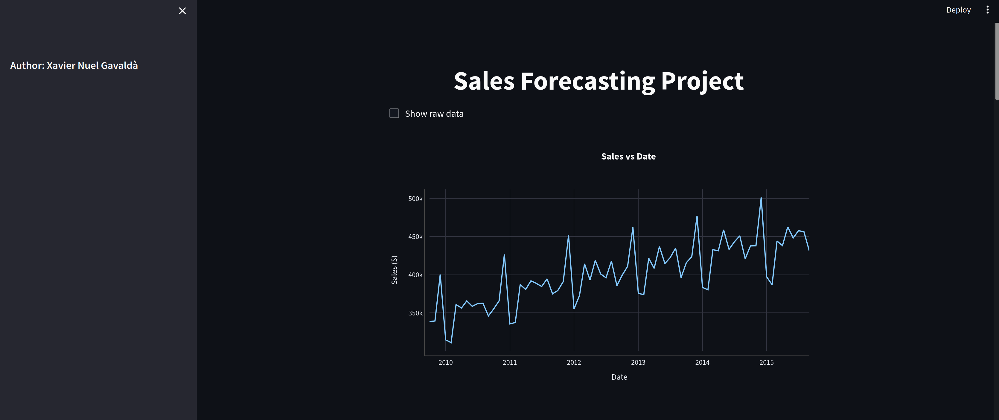
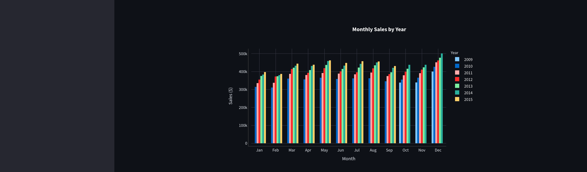
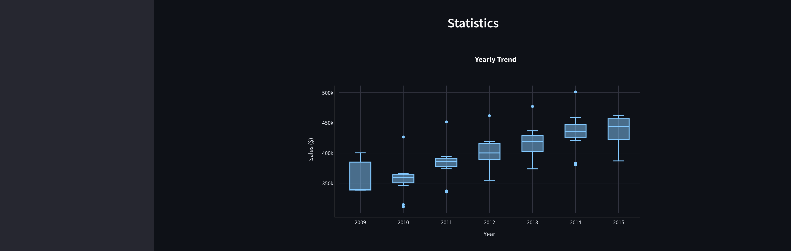
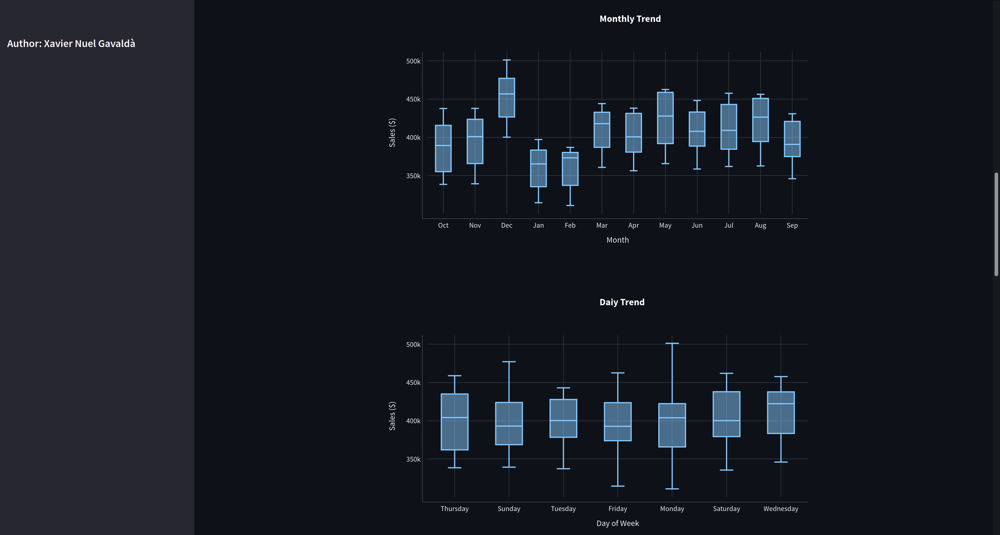
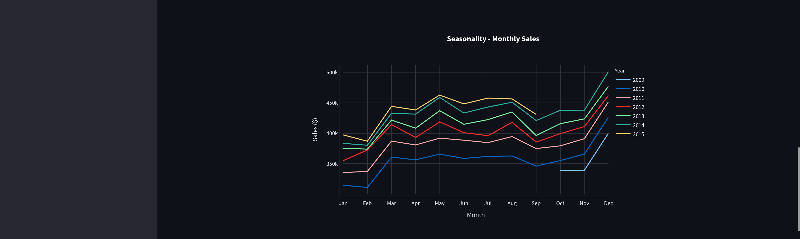
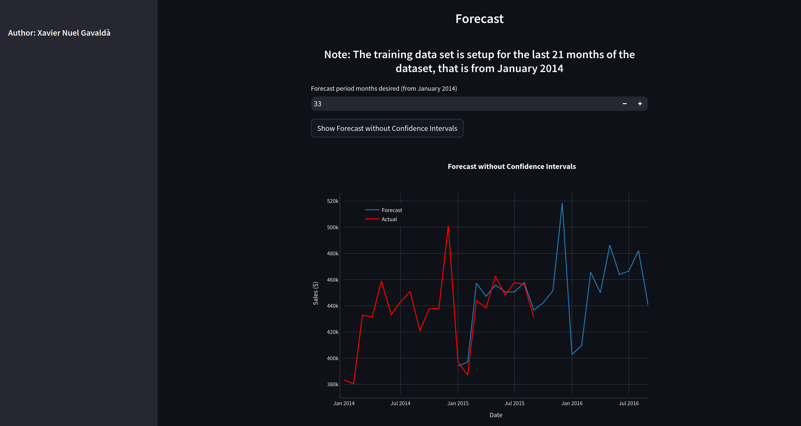
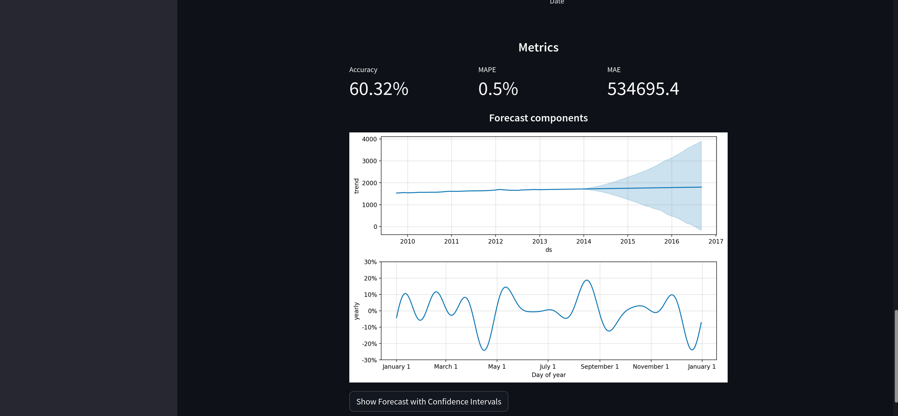

# Project: Sales Forecasting

> The goal of this project is compile the information recently collected about time series forecasting, implement that knowledge into a particular case and finally produce a [Streamlit](https://streamlit.io/) dashboard to show the main results.

> [Dataset](https://www.kaggle.com/datasets/satya19/salesdata)

## Table of Contents

- [General Info](#general-information)
- [Technologies Used](#technologies-used)
- [Setup](#setup)
- [Project Status](#project-status)
- [Room for Improvement](#room-for-improvement)
- [Contact](#contact)
<!-- * [License](#license) -->

## General Information

The goal of this project is to forecast a sales time series using classic forecasting and Machine Learning algorithms:

- Statistical tools for time series
- Single, Double and Triple Exponential Smoothing
- ARIMA family: SARIMA
- Decomposition
- Autocorrelation and Partial Autocorrelation plots
- Stationarity using Dicker-Fuller test
- SARIMA model
- Residuals analysis
- Prophet
- Machine Learning Models: Linear Regression, Random Forest, XGBoost
- Machine Learning feature creation techniques: time lags, date features, target encoding

The most relevant results are shown in an interactive Streamlit dashboard.

## main Technologies Used

- Python 3.8.18
- Streamlit 1.28.0

## Project Status

Project is: first version finished.

This is a list of the Webapp screenshots:

## Room for Improvement

This is just a first attempt and there more options to play with, for example multipages, more plots, and more interactive gadgets.

## Contact

Created by [Xavier Nuel Gavaldà](https://portfolio-xaviernuelgavalda-148e3f5b58a0.herokuapp.com/) - feel free to contact me!

<!-- Optional -->
<!-- ## License -->
<!-- This project is open source and available under the [... License](). -->

<!-- You don't have to include all sections - just the one's relevant to your project -->
